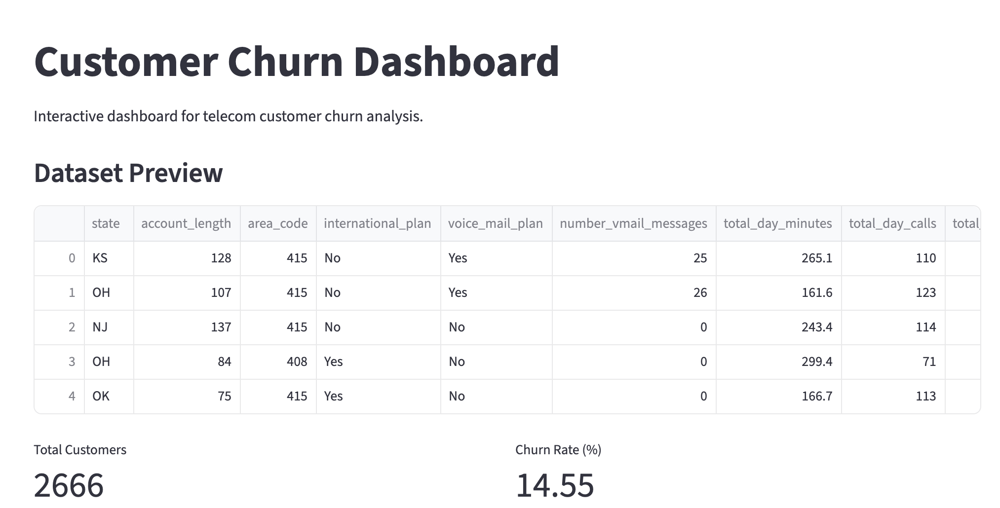
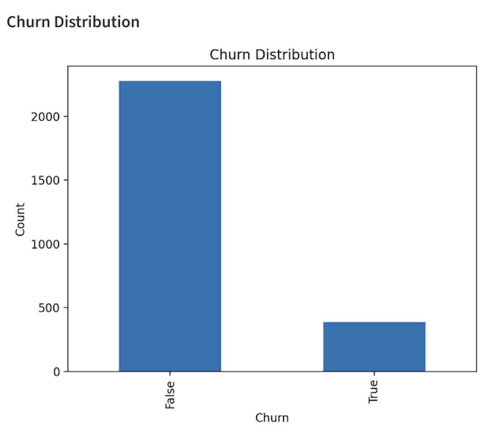
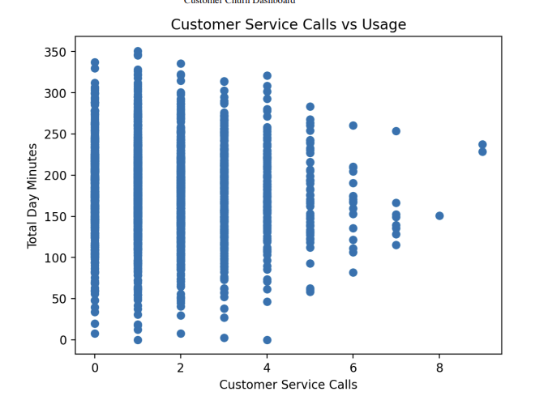

# Customer Churn Dashboard

An interactive Streamlit dashboard for analysing telecom customer churn patterns. This project provides visual insights into customer behaviour and supports data-driven decision-making.

---

## Features
- Interactive dashboard built with Streamlit
- KPI metrics (Total Customers, Churn Rate)
- Churn distribution visualisation
- Customer behaviour analysis (service calls vs usage)
- Clean and user-friendly interface

---

## Technologies Used
- Python
- Streamlit
- Pandas
- Matplotlib

---

## Dataset
The dataset contains telecom customer information including usage behaviour, service plans, and churn status.

---

## Screenshots

### Dashboard Overview


### Churn Distribution


### Customer Behaviour Analysis


---

## Business Value
This dashboard enables organisations to identify patterns in customer churn by analysing usage behaviour and service interactions. It supports proactive customer retention strategies, helping reduce revenue loss and improve customer satisfaction.

---

## How to Run

```bash
pip install -r requirements.txt
streamlit run app.py
